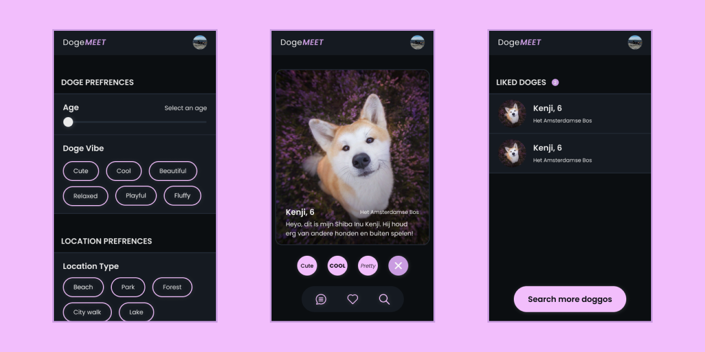

# DogeMeet

Welcome! This is the repository for our matchings application made for project-tech. We worked on a website called DogeMeet. DogeMeet is a machtigings platform made for dog owners. During this project we worked on various features for the web application.

# The concept

With the help of DogeMeet dog owners can connect with each other based on their beloved four legged friends! Users can, in a similar way to Tinder, swipe through other users' dogs. When two people like each other's dogs they can chat with each other. Dog owners can for example meet up to go for a walk.



# How to install

> **NOTE:** Before you can install DogeMeet be sure to have both [Node.js](https://nodejs.org/en/download/) and NPM installed. NPM should automatically be installed when installing Node.js.

You can install the project locally by running the following command in your local folder.

- `git clone https://github.com/Steinberg99/project-tech`

Before you can run DogeMeet you need to create your own database using MongoDB Atlas. You can easily create this database by following [this tutorial](https://docs.atlas.mongodb.com/getting-started/). Once you have created a cluster with a database you need to create these four collections inside your database.

- users
- doggos
- locations
- chat_logs

You can find example data for these collections [here](https://docs.google.com/document/d/e/2PACX-1vR2UaTlE5IqRbFO-w6r9B-n1p0B-V56IXjjcPWSLFm_VFjHa2xSZoIU1SaX24yhD_WQpDfcS88MJr68/pub). We use a program called [MongoDB Compass](https://www.mongodb.com/products/compass) to fill these collection with the example data. The `chat_logs` collection will be filled by the server.

> **NOTE:** The names of the collections are very important, they should be named exactly as mentioned above.

Once you have created the database you need to create a `.env` file in the root folder. This `.env` file should contain two variables.

- DB_URI. The connection string used to connect with the cluster. This is the same link that you used when adding your cluster in MongoDB Compass.
- DB_NAME. The name that you gave your database.
- USER_ID. The object id of the user you want login with. This object id should be in the form of a string.

An example of this `.env` file.

```
DB_URI=place_connection_link_here
DB_NAME=place_database_name_here
USER_ID=place_user_object_id_here
```

> **NOTE:** Make sure that you include this `.env` file in your `.gitignore`. Never upload these sensitive types of information on GitHub. More information about `.gitignore` can be found [here](https://git-scm.com/docs/gitignore).

When you have cloned the repository, created the database and the `.env` file be sure to run the command `npm install` to install all of the project dependencies. Run this command in the root folder of the project. When you have done this you can run the command `npm start` to start DogeMeet. DogeMeet currently only works for mobile screens so be sure to select a mobile screen size using the inspector in Google Chrome (Option + ⌘ + J on macOS or Shift + CTRL + J on Windows). The website should run in the browser when visiting `localhost:4200`.

# Technologies

DogeMeet makes use of the following technologies:

- [Node.js](https://nodejs.org/en/download/),
- [Express](https://expressjs.com/),
- [Pug](https://pugjs.org/api/getting-started.html),
- [MongoDB](https://www.mongodb.com/),
- [Socket.io](https://socket.io/),
- [Sass](https://sass-lang.com/),
- [Heroku](https://www.heroku.com/).

# License

MIT License
